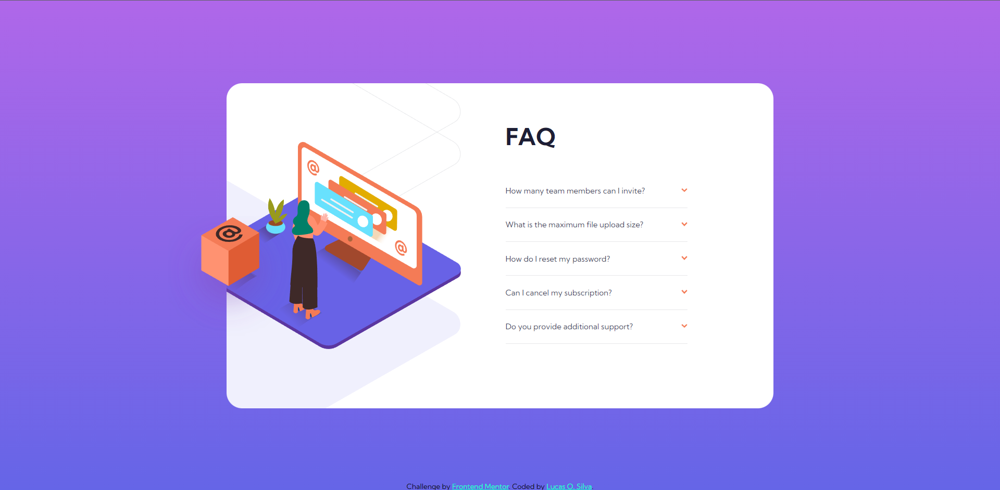
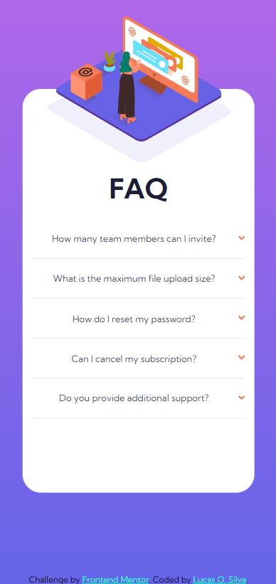

# Frontend Mentor - FAQ accordion card solution

This is a solution to the [FAQ accordion card challenge on Frontend Mentor](https://www.frontendmentor.io/challenges/faq-accordion-card-XlyjD0Oam). Frontend Mentor challenges help you improve your coding skills by building realistic projects. 

## Table of contents

- [Overview](#overview)
  - [The challenge](#the-challenge)
  - [Screenshot](#screenshot)
- [My process](#my-process)

## Overview

This project wasn't too dificulty, but it was great at making me put in practice a bit of Media querie, since I had never used it on a project before. And also getting the backgrounds to work was a bit harder than I initially thought it would be.

### The challenge

Users should be able to:

- View the optimal layout for the component depending on their device's screen size
- See hover states for all interactive elements on the page
- Hide/Show the answer to a question when the question is clicked

### Screenshot

## My process

  I started building the Desktop version first, than did all the JS code to them start with the media queries for the mobile desing, I'm thinking of changing this a bit and starting with the mobile version first on my next project to see how it feels to me.
